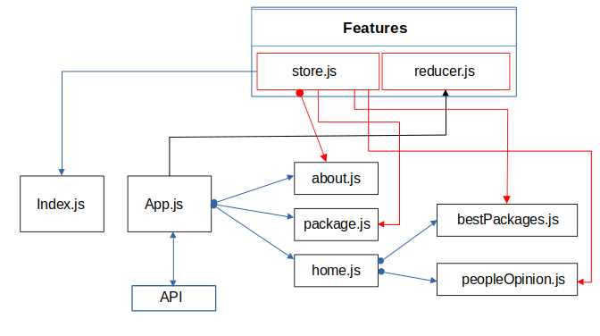
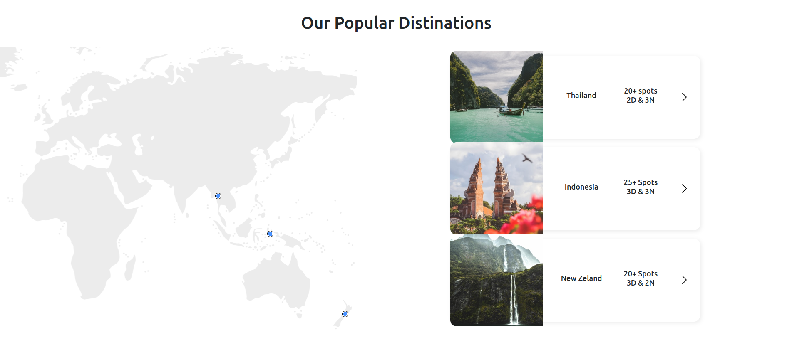
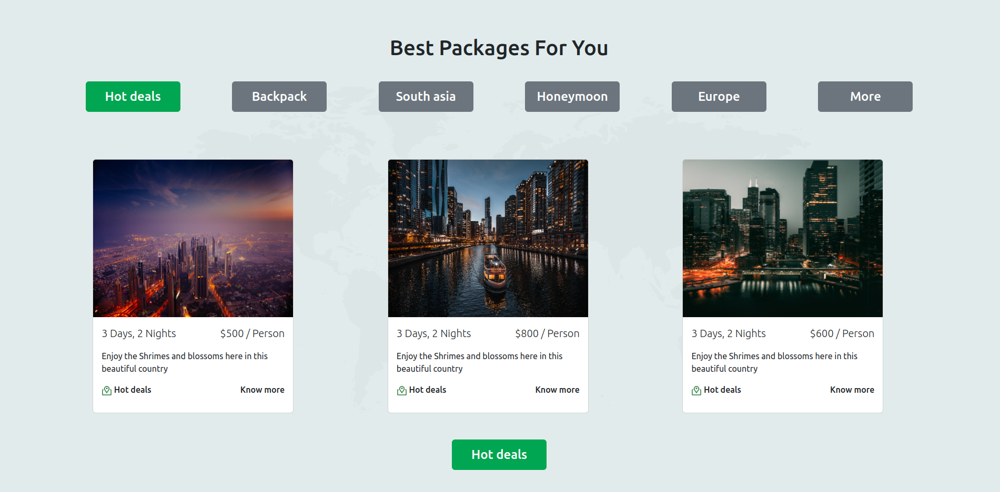

# Description
This is a frontend that uses unsplash API to get images for the UI

## Web app structure

## Stack 
this web app was made using **React** / **Bootstrap** and **CSS Modules**
 

## Example layout:

> Credit to **ARUN KUMAR T** for his figma template

Check out his 
[Template](https://www.figma.com/community/file/1118496825250120167).